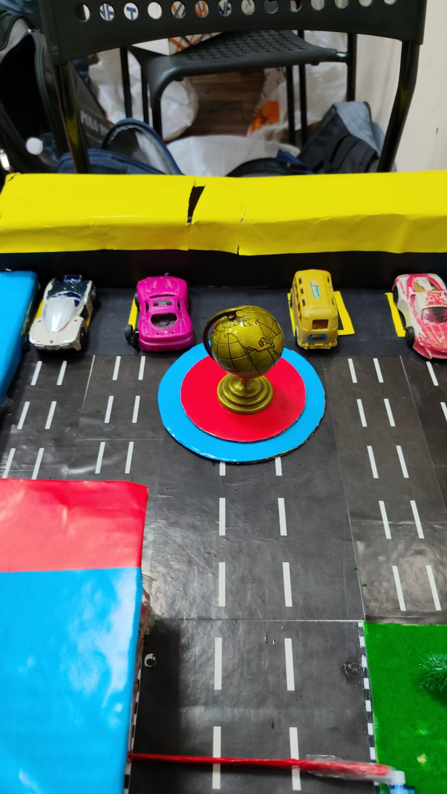
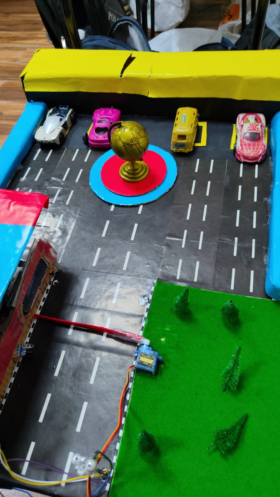
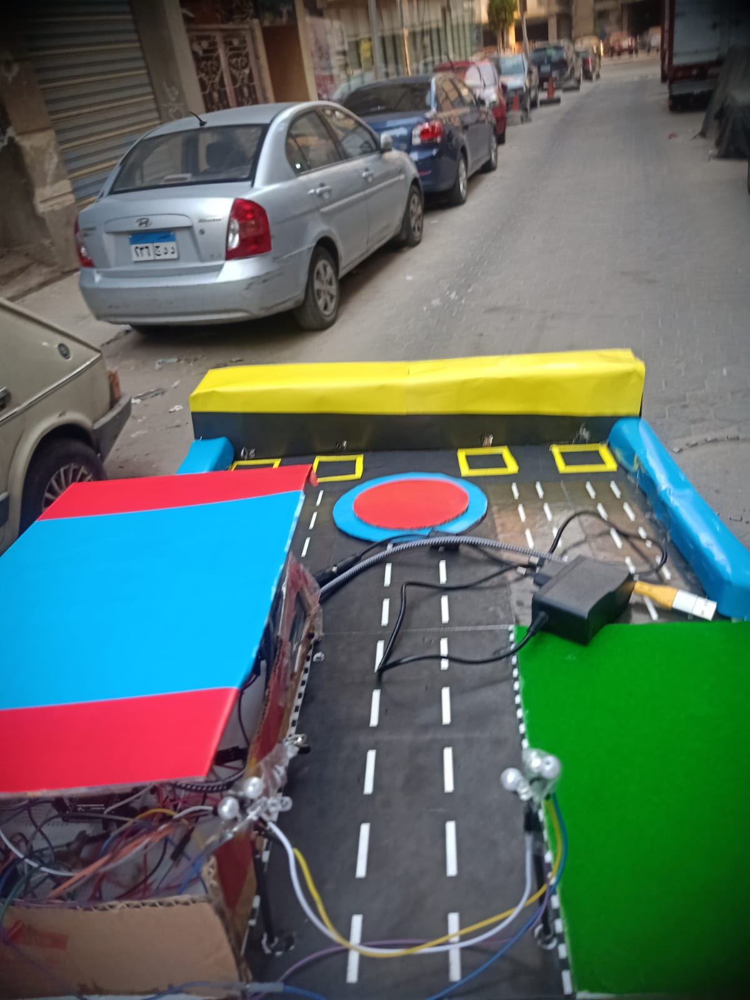
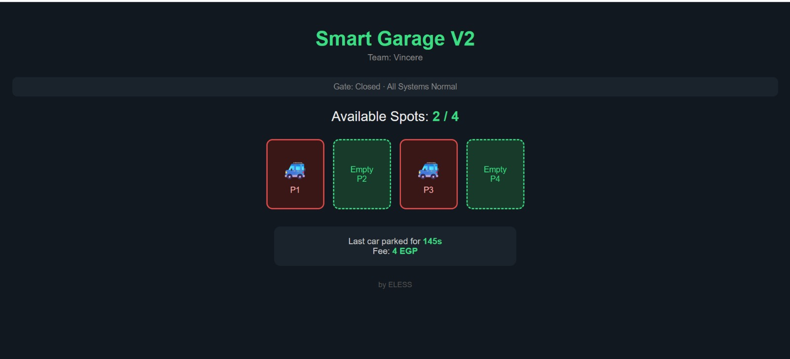
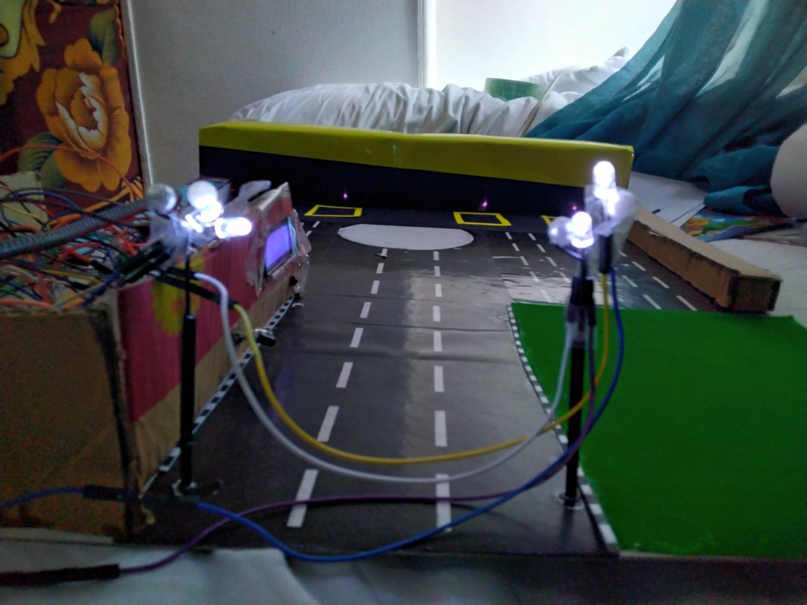

# 🚗 Smart Garage V2

> An ESP32-based smart garage and automation system developed by **Team Vincere**.

## 📌 Overview

Smart Garage V2 is an embedded system built around an **ESP32**, integrating multiple smart systems into one working garage prototype.

The project combines automated gate control, parking monitoring, adaptive lighting, fire safety, LCD feedback, and a locally hosted web dashboard.

---

## ✨ Features

- 🚧 Automated gate control using two IR sensors and a servo motor
- 🅿️ Monitoring of 4 parking spots using IR sensors
- 💰 Parking duration and fee calculation
- 💡 Adaptive lighting using an LDR and potentiometer
- 🔥 Fire detection and emergency gate override
- 📟 Real-time LCD system feedback
- 🌐 Local web dashboard hosted directly by the ESP32
- 📡 ESP32 standalone Wi-Fi Access Point
- ⏱️ `millis()`-based timing
- 🛡️ Sensor debouncing and gate safety timeout

---

## 🧠 System Architecture

The ESP32 acts as the central controller connecting all major subsystems.

ESP32 → Gate System → IR Sensors + Servo

ESP32 → Parking System → 4× IR Sensors

ESP32 → Lighting System → LDR + Potentiometer + LED

ESP32 → Fire Safety → Flame Sensor + Buzzer + Red LED

ESP32 → LCD → System Status

ESP32 → Wi-Fi Access Point → Mobile Phone → Web Dashboard

---

## 🔧 Main Components

| Component | Purpose |
|---|---|
| ESP32 | Main system controller |
| IR Sensors | Gate and parking detection |
| Servo Motor | Automated gate control |
| Flame Sensor | Fire detection |
| LDR | Ambient light detection |
| Potentiometer | LED brightness control |
| 16×2 I2C LCD | System feedback and status |
| Buzzer | Fire alarm |
| Red LED | Fire warning |
| LED | Garage lighting |

---

## 🚧 Automated Gate System

The gate uses two IR sensors and a servo motor to manage vehicle entry and exit.

### Entry Flow

Car detected → Check available parking → Open gate → Car passes → Close gate

### Exit Flow

Car detected → Open gate → Car passes → Close gate

The system tracks the number of cars currently inside the garage.

A safety timeout prevents an interrupted gate sequence from remaining active indefinitely.

---

## 🅿️ Parking System

The garage contains **4 parking spots**, each monitored by an IR sensor.

Each spot is continuously tracked as:

- `Occupied`
- `Empty`

The system calculates:

- Available parking spaces
- Parking duration
- Parking fee

### Pricing

Rate: **2 EGP / minute**

Minimum fee: **1 EGP**

The LCD and web dashboard are updated with the current parking status and latest transaction information.

---

## 💡 Smart Lighting System

The lighting system uses both an **LDR** and a **potentiometer**.

The LDR detects the surrounding light level, while the potentiometer controls the LED brightness.

When sufficient sunlight is detected, the garage lighting is turned off.

---

## 🔥 Fire Safety System

Fire detection has the highest priority in the system.

When the flame sensor detects fire:

**Flame Sensor → Fire Detected → Buzzer + Red LED + LCD Alert + Gate Opens**

The gate is automatically forced open for emergency evacuation, while normal gate operations are overridden.

The LCD displays an emergency warning and the dashboard also reflects the fire alarm status.

---

## 📟 LCD Monitoring

The 16×2 I2C LCD provides real-time feedback from the system.

It can display:

- Available parking spaces
- Parking spot map
- Welcome messages
- Goodbye messages
- Parking duration
- Parking fee
- Fire alarm status
- Emergency messages
- ESP32 Access Point information
- ESP32 IP address

---

## 🌐 Local Web Dashboard

A major feature of Smart Garage V2 is its locally hosted web dashboard.

The ESP32 creates its own Wi-Fi Access Point, allowing a mobile phone to connect directly to the garage system without requiring an external router or internet connection.

**ESP32 → Wi-Fi Access Point → Mobile Phone → IP Address shown on LCD → Web Browser → Local Dashboard**

### Dashboard

The dashboard provides information about:

- 🚧 Gate status
- 🚗 Vehicle entry/exit
- 🅿️ Available parking spaces
- Individual parking spot status
- 💰 Last parking duration
- 💵 Last calculated fee
- 🔥 Fire alarm status

---

## 🛠️ Software & Implementation

The project was developed using:

- **Arduino C++**
- **ESP32**
- **ESP32 Wi-Fi Access Point**
- **WebServer**
- **I2C**
- **`millis()`-based timing**
- **Sensor debouncing**
- **State-based LCD control**
- **Emergency override logic**
- **Gate safety timeout**

The system integrates multiple subsystems while keeping the main control loop responsive during normal operation.

---

## 📸 Project Gallery

### Smart Garage V2

### Web Dashboard

### Lighting & LCD System

---

## 🎥 Demo

[▶️ Watch the Smart Garage V2 Demo](https://drive.google.com/file/d/1GiO7K6huaqfgBKdYIsO6L8E8KnPvTDqq/view?usp=drivesdk)
---

## 👥 Team

### Team Vincere

Smart Garage V2 was developed as a team project by **Vincere**.

---

## 📚 Project Purpose

This project was developed as a hands-on engineering project to explore the integration of:

**Embedded Systems + Sensors + Actuators + Automation + Local Web Interfaces**

into one complete working prototype.

---

## 📄 License

This project was developed for educational purposes.
